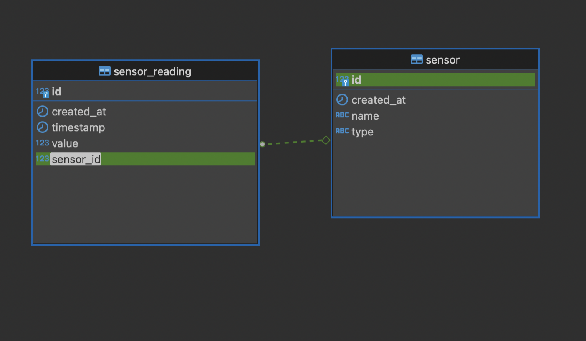
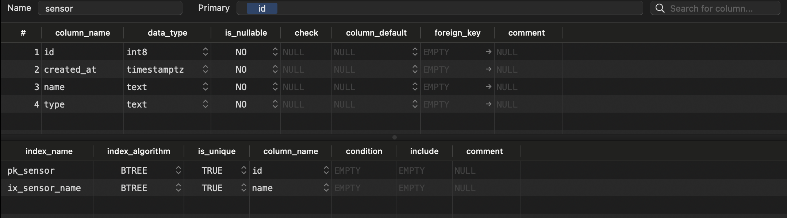
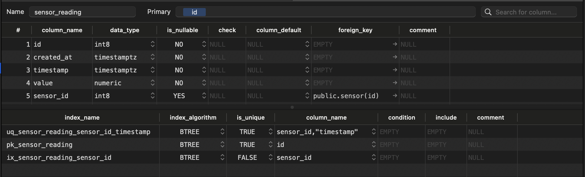

## Sensor Reading Csv Data Processing

This repo implement Work Queue System to process multiple large csv files in a distributed way

### Setup

```
./scripts/setup.sh

or

make setup
```

### Start the work queue

```
docker compose up -d

or

make start
```

### Enqueue the jobs

```
docker compose run --rm --no-deps enqueue [-h] [--dbhost DBHOST] [--dbname DBNAME] [--dbuser DBUSER] [--dbpass DBPASS] [--dbport DBPORT] directory

or

make enqueue ARGS="[-h] [--dbhost DBHOST] [--dbname DBNAME] [--dbuser DBUSER] [--dbpass DBPASS] [--dbport DBPORT] directory"
```

### Generate Data

```
docker compose run --rm --no-deps worker [--size] [--output]

or

make enqueue ARGS="[--size] [--output]"
```

### ER diagram



### Table Structure





### Tech Stack

- Celery
- Rabbitmq
- Postgres
- Docker
- SQLAlchemy
